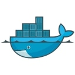

# Icons

This repository contains a collection of icons for various technologies, frameworks, and tools used in development. The icons are organized into categories for easy access.

## Categories

### API Development Tools

  
  
  
  

### Backend Frameworks

  
  
  
  
  
  
  

### Backend Graph Databases

  

### Backend NoSQL Databases

  
  
  
  
  
  

### Backend Relational Databases

  
  
  
  
  

### DevOps & Cloud

  
  
  
  
  
  
  
  
  
  
  
  
  

### Essential Tools

  
  
  
  
  
  
  
  
  
  

### Frontend Tools & Technologies

  
  
  
  
  
  
  
  

### Frontend Build Tools

  
  
  
  

### Frontend Frameworks & Libraries

  
  
  
  
  

### Game Development

  
  
  

### Languages

  
  
  
  
  
  
  
  
  
  
  
  
  
  
  

### Machine Learning

  
  
  

### Mobile Development

  
  
  
  
  
  

### ORM Libraries

  
  
  

### Testing Frameworks

  
  
  
  
  
  
  

### Version Control

  
  
  
  

