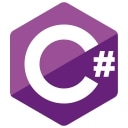
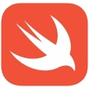

# Icons

This repository contains a collection of icons for various technologies, frameworks, and tools used in development. The icons are organized into categories for easy access.

## Categories

### API Development Tools
- 
- 
- 
- 

### Backend Frameworks
- 
- 
- 
- 
- 
- 
- 

### Backend Graph Databases
- 

### Backend NoSQL Databases
- 
- 
- 
- 
- 
- 

### Backend Relational Databases
- 
- 
- 
- 
- 

### DevOps & Cloud
- 
- 
- 
- 
- 
- 
- 
- 
- 
- 
- 
- 
- 

### Essential Tools
- 
- 
- 
- 
- 
- 
- 
- 
- 
- 

### Frontend Tools & Technologies
- 
- 
- 
- 
- 
- 
- 
- 

### Frontend Build Tools
- 
- 
- 
- 

### Frontend Frameworks & Libraries
- 
- 
- 
- 
- 

### Game Development
- 
- 
- 

### Languages
- 
- 
- 
- 
- 
- 
- 
- 
- 
- 
- 
- 
- 
- 
- 

### Machine Learning
- 
- 
- 

### Mobile Development
- 
- 
- 
- 
- 
- 

### ORM Libraries
- 
- 
- 

### Testing Frameworks
- 
- 
- 
- 
- 
- 
- 

### Version Control
- 
- 
- 
- 
